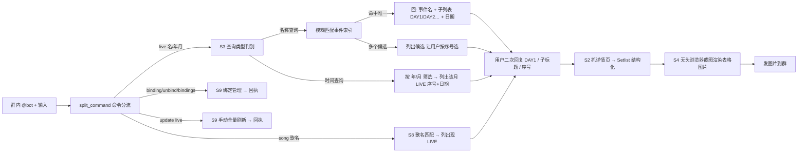

# 子项目：歌曲列表 bot（songbot）— 实施计划

> 所属项目：爱马仕官方新闻 QQ 转发机器人（同一仓库下的**子项目**）。
> 目标：基于 https://imas-db.jp/song/event 的歌曲列表，实现群内 `@bot` 回复 Live 名字 → 给出子列表（day1/day2…）→ 用户再次确认名字 → 给出该公演的歌曲列表，并按**原网页格式渲染成图片**发送。
> 创建：2026-08-26；状态：✅ **S1–S9 + S7 收尾全部完成（2026-08-27，全仓单测通过、live 群内两段交互验收通过、合并回主仓库）**；2026-08-27 追加 S10（待实现）：列表图片渲染（`render_list`）+ @only 门控，见 `docs/S10-list-image-atbot-plan.md`；追加 S11（待实现）：早期演者颜色兼容修复，见 `docs/S11-legacy-color-fix-plan.md`。**S9 已完成（2026-08-27：强制前缀命令 `live`/`binding`/`unbind`/`bindings`/`update live` + `s9_binding.py` + `refresh_all`，详见 S9 计划与工作日志）**；S8 并行线程执行中（`song` 命令未接入，S9 已预留 `COMMANDS` 与 `song_refresher` 接入点）。
>
> **可执行施工图见 [`S1-S7-taskplan.md`](S1-S7-taskplan.md)**（S1–S7 逐步骤实现、选择器、单测要点、验收清单、产出文件）；本文档为总体计划与契约正文。

---

## 0. 已拍板决策（2026-08-26）

| 项 | 决策 |
|---|---|
| 代码放置 | **独立子目录 `songbot/`**（与 `src/` 平级），复用 `vendor/` 与配置模式 |
| 图片渲染 | **无头浏览器截图（高保真）**：驱动系统 Edge（`channel="msedge"`） |
| @bot 事件接收 | **OneBot 11 HTTP POST 上报 + 本地 HTTP 接收器**（NapCat 追加 `postUrls`） |
| 运行方式 | **独立进程**，与现有新闻推送 bot（`src/main.py`）并存 |
| 数据源 | `imas-db.jp/song/event`（服务端渲染 HTML，无 JSON API） |
| 时间筛选入口 | 「按年/月筛选 LIVE」：`2026年7月` / `2026-07` / `7月`（无年份默认最新年份）→ 两段式：列出该月 LIVE（序号+日期）→ 选序号/名字 → 出图（2026-08-27 拍板） |
| 命令式入口 | 输入改为 `@bot live <Live名\|年月>` / `@bot song <歌名>`（**强制前缀**，无前缀回用法提示；`song` 见 S8 计划，2026-08-27 拍板） |
| 绑定与刷新 | `binding <略缩> <event_name>`（唯一命中才绑）/ `unbind <略缩>` / `bindings` / `update live` 手动全量刷新（见 S9 计划，2026-08-27 拍板） |
| 列表图片 + @only 门控 | 列表类回复渲染成图片（S4 `render_list`）；未 @bot 消息一律忽略（二次确认也要求 @bot）（见 S10 计划，2026-08-27 拍板） |

---

## 1. 目标与范围

- **输入**（命令式，强制前缀）：`@bot live <Live 名>`（日文/英文/缩写皆可）或 `@bot live <年/月>`（`2026年7月` / `2026-07` / `7月`，无年份默认最新年份）；`@bot song <歌名>` 反查该歌出现过的 LIVE（见 S8 计划）；`@bot binding <略缩> <event_name>` / `@bot unbind <略缩>` / `@bot bindings` / `@bot update live`（见 S9 计划）。
- **处理**：`split_command` 分流命令 → `live` 走模糊匹配/时间筛选事件索引 → 返回子列表（多日）或候选 → 用户二次确认 → 抓详情页 → 渲染 setlist 图片；`song` 走歌曲反向索引（S8）。
- **输出**：以**图片**形式发送——公演的「セットリスト」（No. / 楽曲 / 演者 表格，还原原网页版式）；**列表类回复**（候选 / 子列表 / 时间筛选 / 歌曲出现 / 绑定）也渲染成图片（序号 + 日期），避免文本过长。
- **非目标**：不做歌曲详情页、不做增量推送、不做多账号、不翻译歌词/歌名（专名保持原文）。

## 2. 现状调研结论（逆向，2026-08-26）

| 项 | 结论 |
|---|---|
| 协议 | 纯 **HTTP**（`https://` 连接失败）；服务端渲染，**无 JSON API**（`index.js` 仅品牌筛选 UI） |
| 列表页 `/song/event` | 单页 **125 个顶层事件**，按 `<h2>YYYY年</h2>` 分组（2013–2026，14 年）；事件 `<li data-brand-ids>`：单页事件直接一个 `<a>`，多日事件嵌套 `<ul><li>`（DAY1/DAY2… + 日期 `<small class="date">`） |
| 详情页 `xxx.html` | 标题 `h1#page_title`；日期/场馆行：含 `開場/開演` 与 `<a>詳細</a>`（官方公式サイト链接，位置因版式而异：`div.m-2` / `<p>` / `div.mx-3 my-2`）；出演者：文本以「出演」开头的 div 内 `span.idol-name`；核心 `<table class="tracklist">`（表头 No./楽曲/演者；行内歌名 + 品牌徽章 `<small class="badge">`、演者 `<span class="idol-name">`）。**实测三种版式**（IWSF / 13thLIVE / 音乐剧 DERE），音乐剧有公演日程表、幕标题行（`tr.part-header`）与无序号行，解析已泛化（详见 S2 工作日志） |
| 编码坑 | `Content-Type` 无 charset，PowerShell 默认解码乱码；须按**字节 UTF-8** 解码（Python httpx 显式 `.content.decode('utf-8')`） |

## 3. 交互流程



- 命令式输入（强制前缀）：`live <名/年月>` 走现有两段式（多日子列表 → 确认；单页直接渲染；时间查询列该月 LIVE 上限 10 条）；`song <歌名>` 走 S8 歌曲反查（列出现 LIVE → 选 → 出图）；`binding`/`unbind`/`bindings`/`update live` 为 S9 管理命令（直接回执，不走渲染流程）。
- **列表类回复渲染成图片**：候选 / 子列表 / 时间筛选 / 歌曲出现 / 绑定等「序号 + 名称 + 日期」列表统一走 `render_list`（S4 泛化）发图，图内附「回复序号」footer，避免长文本刷屏。
- 会话状态：`(group_id, user_id) → 待确认事件`，默认 5 分钟超时失效；**二次确认同样要求 @bot，未 @ 的消息一律忽略**（2026-08-27 拍板）。

## 4. 目录结构

```
songbot/
  __init__.py
  models_song.py     # 数据契约 dataclass（Event/SubEvent/Track/Setlist，单一事实源）
  s1_fetch_events.py # 列表抓取+解析：/song/event → Event[]
  s2_fetch_setlist.py# 详情抓取+解析：xxx.html → Setlist
  s3_match.py        # split_command + 查询类型判别 + 模糊匹配 + 按年月筛选：live 输入 → 候选 Event[]
  s4_render.py       # 无头浏览器截图：Setlist/列表 → PNG（render_setlist + render_list）
  s5_receiver.py     # OneBot 事件接收（本地 HTTP）+ 会话状态
  s8_song_index.py   # 歌曲反向索引：构建/增量刷新/缓存 + match_songs（S8）
  s9_binding.py     # 绑定别名存储 + resolve_binding（S9）
  bot.py             # 主控：接收 → 命令分流 → 匹配 → 确认 → 渲染 → 发图（独立进程）
tests/
  test_s1_fetch_events.py
  test_s2_fetch_setlist.py
  test_s3_match.py
  test_s4_render.py
  test_s5_session.py
scripts/
  probe_song_event.py    # 探针：打印 125 事件 + 3 个 setlist
  acceptance_song.py     # 验收：两段交互 live 走通
docs/modules/
  S-songbot-plan.md      # 本文档
  S1-...-worklog.md …    # 各阶段工作日志
```

## 5. 模块与数据契约

### 5.1 数据契约（`songbot/models_song.py`）

```python
@dataclass SubEvent:          # 子公演（day1/day2…）
    title: str                # 显示名，如 "DAY1 -YAKUDOU-"
    full_title: str           # <a title> 完整标题
    url: str                  # 详情页 URL
    date: str                 # 日期文本，如 "2026/07/24(金)"

@dataclass Event:             # 顶层事件
    title: str                # 事件名
    year: str                 # "2026"
    date: str                 # 单页事件日期文本（如 "2026/07/04(土)・05(日)"，去 "- " 前缀）；多日事件为 ""（用子事件日期）
    brands: list[str]         # 品牌徽章名列表（可空）
    url: str                  # 单页事件详情 URL；多日事件为 "" 
    sub_events: list[SubEvent]  # 多日事件的子列表；单页为空 []

@dataclass Track:             # 歌曲行
    no: int
    title: str                # 歌名
    brand: Optional[str]      # 品牌徽章（无则 None）
    performers: list[str]     # 演者名列表
    performer_colors: list[Optional[str]] = []   # 演者应援色（与 performers 平行；group>attr>brand，无则 None）[S2 2026-08-27 追加]
    link: Optional[str]       # /song/detail/N.html（无则 None）

@dataclass Setlist:           # 公演详情
    title: str                # h1 标题
    date_venue: str           # 日期/场馆行
    performers: list[str]     # 出演者列表
    performer_colors: list[Optional[str]] = []   # 出演者应援色（语义同 Track.performer_colors）[S2 2026-08-27 追加]
    tracks: list[Track]
    url: str
```

### 5.2 各模块职责与验收

| 阶段 | 职责 | 验收标准 |
|---|---|---|
| **S1 列表抓取+解析** | 抓 `/song/event`（UTF-8），BS4 解析出 `Event[]` | `scripts/probe_song_event.py` 打印 125 事件，多日事件 day 子项/日期/URL 正确 |
| **S2 详情抓取+解析** | 抓公演 `.html`，解析 `h1`/日期场馆/出演者/`table.tracklist` → `Setlist` | ✅ 3 个真实 URL 输出结构化 setlist 正确（2026-08-27，40/40 单测） |
| **S3 匹配+时间筛选** | 查询类型判别（时间/名称）；名称走归一化+模糊打分，时间走 `filter_by_time` 按年/月筛选；返回唯一命中或候选列表 | 用 IWSF2026 / 13thLIVE / シャニ / 学園 等样本验证；`2026年7月`/`7月` 时间筛选正确 |
| **S4 图片渲染** | 无头浏览器（Edge）截图还原表格版式，长表分页；**列表类回复也渲染成图片（`render_list`，S4 泛化）** | ✅ 2026-08-27：三份 fixture 渲染 PNG 版式一致、徽章色保真、日文正常（程序化验证；产物 data/songbot_img/acceptance_20260827/）；`render_list` 待实现 |
| **S5 事件接收+会话** | 本地 HTTP 服务收 OneBot 群消息；会话状态（group+user → 待确认，超时失效） | ✅ 2026-08-27：模拟 POST 事件（array/string 双形态）被正确解析；会话 set/get/超时通过（34/34 单测 + `scripts/acceptance_s5.py` ALL PASS） |
| **S6 主控串联+验收** | 串联 S1–S5；配置 NapCat `postUrls`；live 两段交互走通（含时间查询分支） | 测试群 @bot 完整走通 |
| **S7 文档/单测/挂载** | 补单测、工作日志、`docs/index.md`、后台挂载脚本 | 全仓测试通过，可常驻 |

## 6. 风险与对策

| 风险 | 对策 |
|---|---|
| Playwright 依赖（pip 被拦截） | 复用 `scripts/fetch_vendor_deps.py` 思路 vendor 化 wheel；用 `channel="msedge"` 驱动系统 Edge，免下载 Chromium |
| 站点仅 HTTP | 抓取用 httpx（明确 `http://`）；截图加载 `http://` 页面 |
| 编码（无 charset） | 一律 `bytes.decode('utf-8')`，不信任默认解码 |
| NapCat 配置改动 | 只追加 `postUrls`（事件上报），不动 3000 发送通道；与现有新闻 bot 并存 |
| 模糊匹配误命中 | 多候选时列候选让用户选，不静默猜 |
| 长 setlist 超图片高度 | 分页/加高截图高度，Pillow 自动裁白边 |
| 日期文本异常形态（无 `YYYY/MM`、`(DAY1夜・DAY2昼)` 等） | `parse_month` 防御：无匹配仅按年份筛选；跨月以起始月为准（fixtures 未发现真实跨月） |
| 列表类回复渲染图片延迟 | 复用 S4 管线（必要时复用浏览器实例/截图会话）；列表短时可回退文本 |

## 7. 维护约定

- 每阶段完成同步更新 `docs/index.md`（新增「子项目 songbot」小节）与本计划状态。
- 契约改动回改本文档 §5.1；模块统一 `from songbot.models_song import ...`，禁止重复定义同名 dataclass。
