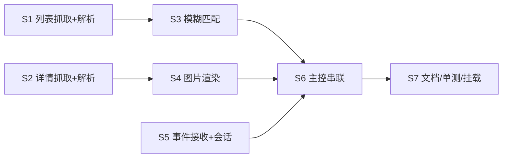

# S1–S7 完整任务计划（施工图）— 歌曲列表 bot（songbot）

> 本文件是 `S-songbot-plan.md` 的**可执行施工图**：把 S1–S7 拆成可直接照着写的任务，
> 含逐步骤实现细节、选择器、数据契约、单测要点、验收清单与产出文件。
> 子任务完成前，本文件为唯一实施依据；契约改动必须回改本文档「契约」小节并同步 `S-songbot-plan.md`。
> S8「歌曲反查 Live」为独立追加计划，见 `docs/S8-song-lookup-plan.md`（契约扩展 `Appearance`/`SongEntry`）。

---

## 0. 总览

### 0.1 阶段依赖与并行



- **唯一串行前置点**：冻结契约 `models_song.py`（所有模块 `import` 它，避免接口漂移）。
- **S1 / S2 / S5 完全并行**（互不依赖）。
- **S3 / S4 也可与 S1 / S2 并行**：S3 只依赖 Event 的*结构*、S4 只依赖 Setlist 的*结构*（契约已冻结），均可先用 mock 数据开发 + 单测；其「验收」需等 S1 / S2 的真实数据。
- **S6 是唯一强串行集成点**：必须等 S3 + S4 + S5 真实实现完成。
- **S7 全程伴随**（每阶段顺手补单测与工作日志），「合并回主仓库」放最后。

**并行执行波次**

| 波次 | 任务 | 关系 | 前置 |
|---|---|---|---|
| 前置 | 冻结 `models_song.py` 契约 | 串行（唯一） | 无 |
| Wave 1 | S1、S2、S5（+ S3、S4 用 mock 开发） | 并行 | 契约冻结 |
| Wave 2 | S3、S4 换真实数据做验收 | 并行 | S1 / S2 完成 |
| Wave 3 | S6 主控串联 | 串行（集成点） | S3 + S4 + S5 完成 |
| 收尾 | S7 合并回主仓库、后台挂载脚本 | 串行 | S6 live 验收通过 |

> 当前进度（2026-08-27）：S1 ✅、S2 ✅、**S3 ✅（52/52 单测 + 样本查询/时间筛选离线验收，含契约补漏 `Event.date` 与 MOIW 别名；S9 追加 `split_command` 命令分流，S3 单测 61/61）**、**S4 ✅（18/18 单测 + 三 fixture 渲染验收 + 应援色）**、**S5 ✅（34/34 单测 + 模拟 POST/会话 TTL 离线验收 + chunked 请求体补强）**、**S6 ✅（30/30 单测 + `scripts/acceptance_song.py` 离线全链路 ALL PASS（含 `--real-render`）+ live 群内两段交互验收通过（测试群 450599137）；S9 改为强制前缀后离线链路仍 ALL PASS）** 已完成；**S9 ✅（2026-08-27：强制前缀 `live`/`binding`/`unbind`/`bindings`/`update live` + `s9_binding.py` + `refresh_all`，详见 `docs/S9-bindings-update-plan.md` 与 `docs/modules/S9-bindings-update-worklog.md`）**；**S8 ⏳ 并行线程执行中**（`song` 命令未接入，S9 已在 `COMMANDS` 与 `refresh_all` 预留接入点）
> → 剩余 **S7 收尾（全仓测试/后台挂载/合并回主仓库）**。

### 0.2 里程碑

| 里程碑 | 阶段 | 判定 |
|---|---|---|
| M1 | S1 | ✅ 2026-08-27：探针打印 125 事件（离线 fixture 与 live 官方站点一致），多日事件的 DAY 子项/日期/URL 正确；单测 25/25 |
| M2 | S2 | ✅ 2026-08-27：3 个真实 URL 输出结构化 `Setlist` 正确（离线 fixture 与 live 一致）；单测 40/40 |
| M3 | S3 | 样本查询（IWSF2026 / 13thLIVE / シャニ / 学園）命中正确；`2026年7月`/`7月` 时间筛选正确 |
| M4 | S4 | ✅ 2026-08-27：三份 fixture（IWSF/13thLIVE/DERE）渲染 PNG 版式正确、徽章色保真、日文无缺字（程序化验证 + 人工目检产物在 data/songbot_img/acceptance_20260827/）；单测 18/18 |
| M5 | S5 | ✅ 2026-08-27：模拟 OneBot 事件（array/string 双形态）被正确解析、会话 set/get/超时可用；单测 34/34 |
| M6 | S6 | 测试群 `@bot` 两段交互走通 |
| M7 | S7 | 全仓测试通过、可后台常驻 |

### 0.3 总交付物清单

```
songbot/
  __init__.py
  models_song.py        # 契约 dataclass（单一事实源）
  s1_fetch_events.py
  s2_fetch_setlist.py
  s3_match.py
  s4_render.py
  s5_receiver.py
  bot.py                # 主控
tests/
  test_s1_fetch_events.py
  test_s2_fetch_setlist.py
  test_s3_match.py
  test_s4_render.py
  test_s5_receiver.py
scripts/
  probe_song_event.py   # S1/S2 探针
  acceptance_song.py    # S6 live 验收
  start_songbot.cmd     # S7 后台挂载
  stop_songbot.cmd
docs/modules/S1-...-worklog.md …   # 各阶段工作日志
```

### 0.4 通用约定（所有阶段）

1. **依赖 vendor 化**：`import httpx` / `from bs4 import BeautifulSoup` 失败时回退 `sys.path.insert(0, <vendor>)`（写法照抄 `ref/m1_fetcher.py` 顶部）。
2. **编码**：抓取一律 `resp.content.decode('utf-8')`，禁止信任默认解码（站点 `Content-Type` 无 charset）。
3. **URL**：站点**纯 HTTP**；相对路径（`./xxx.html`、`/song/detail/N.html`）统一 `urljoin('http://imas-db.jp/song/event/', href)` 解析成绝对 `http://` URL。**注（2026-08-27 实测）**：线上 `http://imas-db.jp/song/event`（无尾斜杠）返回 301 补尾斜杠，`fetch_events` 用 `follow_redirects=True` 且 urljoin 基准 `url.rstrip('/') + '/'` 处理（已在 S1 实现）。
4. **契约**：所有模块 `from models_song import ...`，禁止重复定义同名 dataclass。
5. **单测**：解析类单测用 `fixtures/*.html` 本地样本，**不联网**；抓取层可注入 `client`/`transport` mock。

---

## S1 列表抓取 + 解析

**目标**：抓 `/song/event`，解析出全部顶层事件（含单页/多日、子公演、日期、URL、品牌、年份）。

**契约（models_song.py）**

```python
@dataclass
class SubEvent:               # 子公演（day1/day2…）
    title: str                # 显示名，如 "DAY1 全力援走" / "第一公演 -YAKUDOU-"
    full_title: str           # <a title> 完整标题
    url: str                  # 绝对 URL
    date: str                 # 日期文本，如 "2026/05/05(火祝)"

@dataclass
class Event:                  # 顶层事件
    title: str                # 事件名（去除徽章/日期后的纯文本）
    year: str                 # "2026"（去 "年"）
    date: str                 # 单页事件日期文本（去 "- " 前缀，如 "2026/07/04(土)・05(日)"）；多日事件为 ""（用子事件日期）
    brands: list[str]         # 品牌徽章名列表（取 badge 的 title，缺则取文本）
    url: str                  # 单页事件详情 URL；多日事件为 ""
    sub_events: list[SubEvent]  # 多日事件的子列表；单页为空 []
```

**实现（songbot/s1_fetch_events.py）**

入口：`fetch_events(url=EVENT_LIST_URL, *, client=None) -> list[Event]`（最新年份在前，与网页顺序一致）。

1. `httpx.get(url)`，`html = resp.content.decode('utf-8')`，`BeautifulSoup(html, 'html.parser')`。
2. 遍历 `main` 内每个 `div.section`：
   - 年：`section.find('h2').get_text(strip=True)` → 去 `年` 得 `year`。
   - 顶层事件：`section.find('ul')` 的**直接子** `li[data-brand-ids]`（用 `ul.find_all('li', recursive=False)`）。
3. 对每个事件 `li`：
   - 品牌：`[b.get('title') or b.get_text(strip=True) for b in li.find_all('span', class_='badge')]`。
   - 单页判定：`direct_a = li.find('a', recursive=False)` 存在 → `title=direct_a.get_text(strip=True)`、`url=urljoin(...)`、`sub_events=[]`、`date=(li.find('small', class_='date').get_text(strip=True)).lstrip('- ')`。
   - 多日判定：`direct_a is None` 且有嵌套 `ul` → 取标题：复制 `li`，`decompose()` 掉嵌套 `ul`、`span.visually-hidden`、`span.badge`、`small.date`，再 `get_text(' ', strip=True)`；`url=''`、`date=''`（日期在各 SubEvent）。
     - 子事件：遍历嵌套 `ul > li`：`a = x.find('a')`，`title=a.get_text(strip=True)`，`full_title=a.get('title','')`，`url=urljoin(...)`，`date=(x.find('small', class_='date').get_text(strip=True)).lstrip('- ')`。
   - **注意**：`<ruby>`（如「選抜試験(セレクション)」）取文本会得到 rb+rt 连写；接受即可，或用 `rb` 优先（记入已知项，不影响匹配）。
4. 防御：字段缺失给空串/空列表，不抛异常（坏条目记日志跳过）。

**产出**：`songbot/models_song.py`、`songbot/s1_fetch_events.py`、`tests/test_s1_fetch_events.py`、`scripts/probe_song_event.py`。

**单测要点（用 fixtures/imas_db_song_event.html，不联网）**
- 总数 = 125；年份含 2026/2025/…/2013。
- 多日事件 `MILLION LIVE! 13thLIVE` 有 2 个子事件，`DAY1 全力援走` 日期 `2026/05/05(火祝)`、URL 以 `million_13th_day1.html` 结尾。
- 单页事件 `CINDERELLA GIRLS MUSICAL DERE of the DEAD`：`url` 非空、`sub_events == []`、`date == "2026/07/04(土)・05(日)"`。
- 品牌徽章：IWSF 事件的 `brands` 含 765AS/シンデレラ/ミリオン/SideM/シャニ/学園 等。
- 异常：无 `date` 子项、无 `href` 时不抛异常。

**验收清单**
- [x] `python scripts/probe_song_event.py` 打印 125 事件，多日事件的 DAY 名称/日期/URL 与网页一致。（2026-08-27：离线 fixture 与 live 官方站点双验一致）

---

## S2 详情抓取 + 解析

**目标**：抓公演详情页，解析出「セットリスト」结构化 `Setlist`。

**⚠ 实测修正（2026-08-27）**：站点详情页有**三种版式**（见 `docs/modules/S2-fetch-setlist-worklog.md` §3），
下方「实现」的选择器已按三版式泛化，与最初按单一 IWSF 样本写的描述不同：

| 版式 | 样本 fixture | 日期场馆 | 出演者 | tracklist 特征 |
|---|---|---|---|---|
| A | `imas_db_iwsf_day1.html` | `div.m-2`（開場/開演 + `<a>詳細</a>`） | `div.m-2`「出演アイドル:」 | 全行有序号；部分歌带链接与徽章 |
| B | `imas_db_million_13th_day1.html` | `<p>`（開場/開演 + `<a>詳細</a>`） | `div.my-2`「出演:」 | 无徽章；`<small class="notes">(新曲)</small>` 保留在歌名 |
| C | `imas_db_cg_musical_dd.html`（音乐剧） | 公演概要节 `div.mx-3 my-2`（`<a>詳細</a>`）；**另有公演日程表**（DAY1/DAY2 開場/開演 td，不能误当） | `div.mx-3 my-2`「出演:」 | `tr.part-header` 幕标题行（<3 td，跳过）；无序号行（td0 空）；断号行（忠实保留原页编号） |

**契约**

```python
@dataclass
class Track:                  # 歌曲行
    no: int                   # 序号
    title: str                # 歌名（不含徽章）
    brand: Optional[str]      # 品牌徽章（无则 None）
    performers: list[str]     # 演者名列表
    performer_colors: list[Optional[str]] = []   # 演者应援色（与 performers 平行；无则 None）[2026-08-27 追加]
    link: Optional[str]       # /song/detail/N.html 绝对 URL（无则 None）

@dataclass
class Setlist:                # 公演详情
    title: str                # h1#page_title 文本
    date_venue: str           # 日期/场馆行（去 "詳細" 链接）
    performers: list[str]     # 出演者（idol-name 文本）
    performer_colors: list[Optional[str]] = []   # 出演者应援色（语义同 Track.performer_colors）[2026-08-27 追加]
    tracks: list[Track]
    url: str
```

**实现（songbot/s2_fetch_setlist.py）**

入口：`fetch_setlist(url, *, client=None) -> Setlist`；请求层（`_request`/`FetchError`/UA/超时）复用 `s1_fetch_events`。

1. 抓取 + UTF-8 解码 + BS4。
2. `title = soup.select_one('#page_title').get_text(strip=True)`。
3. 日期场馆：首选 `<a>詳細</a>`（官方公式サイト链接）所在 div/p 祖先，移除其中 `<a>` 后 `get_text(strip=True)`；
   无「詳細」链接时兜底取含「開演/開場」的**最短** div/p（最短防外层大容器误匹配）。
4. 出演者：首个文本以「出演」开头的 div 内所有 `span.idol-name` 的文本（覆盖「出演アイドル」「出演」前缀）。
5. 表格：`table.tracklist > tbody > tr`，不足 3 个 `td` 的行跳过（幕标题行/坏行），每行取前三个 `td`：
   - `no = int(td0.get_text(strip=True))`（防御：空/非数字回退为运行序号 len+1）。
   - 乐曲 `td1`：`a = td1.find('a')` → 有则 `link=urljoin(base_url, href)`、`title=a.get_text(strip=True)`；
     否则 `title = td1 去掉 badge/visually-hidden 后的文本`（`<small class="notes">` 如「(新曲)」保留）。
     `brand = badge 的 title 或文本`（无 badge 则 None）。
   - 演者 `td2`：`spans = td2.find_all('span', class_='idol-name')` → `performers=[s.get_text(strip=True) for s in spans]`；
     若为空（如「全員」「城主(穴沢裕介)」）→ `performers=[td2.get_text(strip=True)]`（再空则 `[]`）。
6. **应援色（2026-08-27 追加）**：每个 `span.idol-name` 按 data-* 属性映射颜色（原网页
   `.idol-name{border-bottom:2px solid}` 色带）；**优先级 character > group > attr > brand**
   （对应原网页 CSS 后定义覆盖：brand → attr → group → character 规则依次在后）：
   - `data-character-id`（**角色个人应援色**，348 个角色，原网页大多数用此）
   - `data-group-id`（组合色，48 个）→ `data-*-attr`（属性色，sidem > million-gree > million > cinderella）
   - `data-brand-id`（品牌色，14 个）
   色表来自 `data/songbot_site_colors.json`（`scripts/refresh_site_colors.py` 抓 CSS 提取，块级解析
   兼容逗号分隔共享块），JSON 缺失回退无应援色（颜色 None，行为与旧版一致）；13thLIVE 等出演者块
   显示声优名（idol-name 文本 = CV 名，title = 「idol(CV:…)」）。

**产出**：`songbot/s2_fetch_setlist.py`、`tests/test_s2_fetch_setlist.py`、
`fixtures/imas_db_million_13th_day1.html`、`fixtures/imas_db_cg_musical_dd.html`（后两份为新抓真实页）。

**单测要点（用三份 fixtures，不联网）**
- 标题含 `-YAKUDOU- [DAY1]`；日期含 `2026/07/24`；日期场馆行不含「詳細」链接文本。
- `tracks` 首行 `no=1`、`title="Dance in the Light"`、`brand="ミリオンライブ！"`、`performers` 含 `舞浜歩`。
- 带链接歌曲（如 `Marionetteは眠らない`）`link` 非空且以 `/song/detail/285.html` 结尾。
- 最后一行 `title="ダンス・ダンス・ダンス"`、`performers==["全員"]`。
- 版式 B：`<p>` 日期场馆精确匹配；`brand` 全为 None；`SPARKERS (新曲)` 保留 notes。
- 版式 C：日期场馆 = 场馆行（**非**公演日程表单元格）；幕标题行（`【第X幕 …】`）跳过；
  无序号行 `no` 回退运行序号；有号行忠实保留。
- 缺表格/缺 tbody 时不抛异常返回空 tracks；非数字 no 回退；缺标题/日期行/出演块给空值。

**验收清单**
- [x] `scripts/probe_song_event.py --setlist <url>` 对 3 个真实 URL 输出正确 Setlist。
      （2026-08-27：live 三 URL 与离线三 fixture 输出完全一致）

---

## S3 查询判别 + 模糊匹配 + 时间筛选

**目标**：把用户输入映射到查询类型（时间/名称）；名称 → 唯一事件或候选列表；时间 → 按年/月筛选事件列表（2026-08-27 追加）。

**实现（songbot/s3_match.py，纯函数零网络）**

```python
def split_command(s: str) -> Optional[tuple[str, str]]   # 命令前缀分流："live/song/binding/unbind/update <rest>" -> (cmd, rest)；"bindings" -> ("bindings", "")；无前缀/未知命令 -> None（强制前缀）
def normalize(s: str) -> str          # 名称匹配用：NFKC + casefold + 去空白与分隔符
def normalize_light(s: str) -> str    # 时间判别用：NFKC + casefold + 去首尾空白（保留 / - 分隔符）
def classify_query(s: str) -> str     # "time" | "name"
def parse_time_query(s: str, latest_year: int) -> Optional[tuple[int, Optional[int]]]
#   "2026年7月" -> (2026, 7)；"7月" -> (latest_year, 7)；"2026年" -> (2026, None)；非时间格式 -> None
def parse_month(date_text: str) -> Optional[int]   # 取首个 YYYY/MM 的 MM；无匹配 None
def filter_by_time(events: list[Event], year: int, month: Optional[int] = None) -> list[Event]
def match_events(query: str, events: list[Event]) -> list[Event]  # 按得分降序
```

1. `normalize`：`unicodedata.normalize('NFKC', s)`（全角→半角、片假名/字母统一），`casefold()`，去空白与 `【】「」・-–—/_.:!？` 等分隔符（**名称匹配用**）。
2. **查询类型判别**（在 `normalize_light` 后的原文上进行，**勿用去分隔符的 normalize**，否则 `2026-07` 会变成 `202607` 无法判别）：
   - `^(20\d{2})\s*年?\s*(\d{1,2})?\s*月?$` → 命中 `2026年7月` / `2026年`；
   - `^(20\d{2})[/\-.](\d{1,2})$` → 命中 `2026-07` / `2026/07` / `2026.07`；
   - `^(\d{1,2})月$` → 无年份，`parse_time_query` 用 `latest_year`（索引中最大 `year`）兜底；
   - 均不命中 → `"name"`。`13thLIVE`、`IWSF2026` 等不含「年/月」且非 `YYYY[/-.]MM` 格式，不会误判。
3. `filter_by_time(events, year, month=None)`：
   - `month is None` → 返回 `Event.year == str(year)` 的全部事件；
   - 否则 `year` 匹配且 `parse_month(Event.date)`（单页事件）或各 `SubEvent.date`（多日事件）`== month`；
   - `parse_month` 取日期文本首个 `YYYY/MM`，无匹配返回 `None`（该事件仅按年保留）；跨月以起始月为准；
   - 单次返回上限 10 条（超出提示「还有 N 场…」）。
4. 打分（名称匹配，对每个 Event，得分取该事件所有可匹配文本的最高分）：
   - 候选文本 = `event.title` + 每个 `sub.title` + 每个 `sub.full_title`。
   - **完全相等** → 100；**候选包含 query** 或 **query 包含候选** → 80；**词元交集覆盖** → 60；`difflib.SequenceMatcher.ratio` 兜底 → 按比例。
5. 返回规则：
   - 唯一且分 > 阈值 → `[该 Event]`（后续据此列子列表或直接渲染）。
   - 多个 → 取 top N（默认 5）作候选列表。
   - 无 → `[]`。
6. 额外导出 `match_sub(query, event) -> SubEvent | None`：用于二次确认（"DAY1"/"全力援走"/序号）。
7. `split_command(s)`：按首个空白切分，首词元（casefold 后）∈ {`live`, `song`, `binding`, `unbind`, `bindings`, `update`} 时返回 `(cmd, 剩余)`（`bindings` 无剩余），否则返回 `None`（强制前缀，供 bot.py 分流）。

**产出**：`songbot/s3_match.py`、`tests/test_s3_match.py`。

**单测要点**
- `split_command('live IWSF2026') == ('live', 'IWSF2026')`；`split_command('song Marionetteは眠らない') == ('song', 'Marionetteは眠らない')`；`split_command('binding iwsf IDOL WORLD SUPER FESTIVAL 2026') == ('binding', 'iwsf IDOL WORLD SUPER FESTIVAL 2026')`；`split_command('bindings') == ('bindings', '')`；`split_command('update live') == ('update', 'live')`；`split_command('IWSF2026') is None`（无前缀）。
- `normalize('ＭＩＬＬＩＯＮ') == normalize('million')`；`normalize('I W S F') == normalize('IWSF')`。
- `classify_query('2026年7月') == 'time'`；`classify_query('2026-07') == 'time'`；`classify_query('7月') == 'time'`；`classify_query('2026年') == 'time'`；`classify_query('13thLIVE') == 'name'`；`classify_query('IWSF2026') == 'name'`。
- `parse_time_query('7月', 2026) == (2026, 7)`；`parse_time_query('2026年', 2026) == (2026, None)`；`parse_time_query('13thLIVE', 2026) is None`。
- `filter_by_time(events, 2026, 7)` 命中 `IDOL WORLD SUPER FESTIVAL 2026`（7/24–26）与 `CINDERELLA GIRLS MUSICAL DERE of the DEAD`（7/4・5）；`filter_by_time(events, 2026)` 返回 14 个。
- 日期文本无 `YYYY/MM`（如 `(DAY1夜・DAY2昼)`）不抛异常；无命中返回 `[]`。
- `match_events('IWSF2026')` 命中 `IDOL WORLD SUPER FESTIVAL 2026` 事件。
- `match_events('13thLIVE')` 命中 MILLION 13thLIVE。
- `match_events('シャニ')` 命中 SHINY COLORS 相关；`match_events('学園')` 命中学园事件（可能多候选，验证排序合理）。
- 无命中返回 `[]`；`match_sub('DAY1', event)` 返回对应 SubEvent。

**验收清单**
- [x] 样本查询命中正确（见上）；`2026年7月`/`7月` 时间筛选正确（两段式可走通）。
      （2026-08-27：`python -m songbot.s3_match` 离线验收——IWSF2026/13thLIVE 唯一命中、
      `2026年7月`/`7月`/`2026-07` 均筛出 IWSF+DERE 2 场、`シャニ` 2 候选、`学園` top5；
      S1+S2+S3 全仓回归 118/118；live 两段式走通待 S6 集成）

---

## S4 图片渲染（无头浏览器 · Edge 高保真）

**目标**：把 `Setlist` 渲染成与网页版式一致的 PNG。

**方案（首选 + 兜底）**

- **首选**：vendor 化 `playwright`（连同 `pyee`、`greenlet`，复用 `ref/../scripts/fetch_vendor_deps.py` 思路），`p.chromium.launch(channel='msedge')` 驱动系统 Edge（`C:\Program Files (x86)\Microsoft\Edge\Application\msedge.exe`），**免下载 Chromium**。
- **兜底**（Playwright vendor 失败时）：Edge headless CLI `msedge --headless=new --disable-gpu --hide-scrollbars --screenshot=out.png --window-size=W,H --virtual-time-budget=8000 <url或file>` + Pillow（系统已装）裁白边。

**实现（songbot/s4_render.py）**

入口：`render_setlist(setlist: Setlist, *, out_dir=None) -> list[Path]`（返回一张或多张 PNG 路径，长表分页）。

1. 用模板组装一个**自包含 HTML**（内联 CSS 复刻 `table.tracklist` 样式：表头 No./楽曲/演者、斑马纹、品牌徽章色块、标题/日期/场馆头）。徽章色可用站点已有的 `bg-imas-brand-*` 类名近似色值（硬编码色表）。
2. 浏览器加载该 HTML（`data:` URL 或 `file://` 临时文件）→ 等待渲染 → 定位表格容器元素。
3. **元素级截图**：Playwright `locator(...).screenshot()`（精确裁剪，无多余边）；兜底 CLI 则整页截图后用 Pillow `Image.getbbox()` 裁白边。
4. **分页**：若表格高度超阈值（默认 1 张 ≤ ~3000px），按行拆分输出多张，每张带表头。
5. 后处理（可选）：Pillow 裁白边、PNG 压缩，输出到 `data/songbot_img/<YYYYMMDD_HHMMSS>/`。

**产出**：`songbot/s4_render.py`、`tests/test_s4_render.py`（用 mock Setlist 断言 PNG 生成 + 尺寸 + 分页张数）。

**单测/验收要点**
- 生成 PNG 非空、尺寸 > 0；长表（构造 50 行）返回 > 1 张。
- 日文无缺字（人工目检截图；自动化断言渲染不抛异常）。

**验收清单**
- [x] 对 fixtures 的 day1 setlist 生成 PNG，版式与网页一致、日文正常。
      （2026-08-27：IWSF/13thLIVE/DERE 三份 fixture 渲染成功；程序化验证非空白 + 徽章品牌色
      保真 + 尺寸合理；日文人工目检产物在 `data/songbot_img/acceptance_20260827/`）

---

## S5 事件接收 + 会话

**目标**：接收 NapCat 推送的 OneBot 群消息事件，识别 `@bot`，维护两段交互会话。

**NapCat 配置（前置，S6 一并做）**：OneBot 11 HTTP server 追加 `postUrls: ["http://127.0.0.1:8090/event"]`（通过 NapCat WebUI `POST /api/OB11Config/SetConfig`，`messagePostFormat=array`，见主仓库 `docs/modules/M6-napcat-setup.md`）。

**实现（songbot/s5_receiver.py）**

```python
@dataclass
class Incoming:        # 一条群消息事件
    group_id: str
    user_id: str
    at_bot: bool       # 是否 @ 了 bot
    text: str          # 去掉 CQ 码后的纯文本正文

def parse_event(payload: dict) -> Optional[Incoming]   # 非群消息/非文本返回 None
class SessionStore:                                    # 线程安全，TTL 5 分钟
    def set(self, group_id, user_id, context): ...
    def get(self, group_id, user_id) -> Optional[context]
    def clear(self, group_id, user_id): ...
```

1. `parse_event`：仅处理 `post_type=='message' and message_type=='group'`；`message` 为 array 时（`messagePostFormat=array`）解析每段 `{type, data}`——识别 `type=='at' and data.qq==self_id` 置 `at_bot`，`type=='text'` 拼接正文；`message` 为 string 时用 `raw_message` 正则提取。
2. 本地 HTTP 服务（Python 标准库 `http.server`，无额外依赖）监听 `127.0.0.1:8090`，`POST /event`：读 JSON → `parse_event` → **立即回 200**（避免阻塞 NapCat 上报）→ 交给回调（线程池）处理。
3. `SessionStore`：`dict[(group_id, user_id)] -> (context, deadline)`；读写加锁；惰性清理过期项。

**产出**：`songbot/s5_receiver.py`、`tests/test_s5_receiver.py`、`scripts/acceptance_s5.py`（离线验收）。

**单测要点**
- 构造 `[CQ:at,qq=1666562110]` + 文本的消息 array → `at_bot=True`、`text` 正确。
- 非群消息、非文本消息 → `None`。
- SessionStore set/get/clear + 过期失效（用注入时钟 mock）。

**验收清单**
- [x] 模拟 POST 事件被正确解析；会话 set/get/超时通过。（2026-08-27：`scripts/acceptance_s5.py` ALL PASS + 单测 34/34 双验一致）

---

## S6 主控串联 + 验收

**目标**：`bot.py` 常驻，串联 S1/S2/S3/S4/S5 完成 `@bot` 两段交互。

**实现（songbot/bot.py）**

1. 启动：读 `config.yaml`（`songbot:` 段：监听端口、TTL、事件索引缓存、Edge 路径等）→ `fetch_events()` 构建索引（进程内缓存 + 可选落盘 JSON）→ 启动 HTTP 接收服务。
2. 处理链（回调内）：
   - 事件 `at_bot` 且正文非空 → `split_command(正文)` 分流：
     - 无前缀/未知命令 → 回用法提示（强制前缀：`live` / `song` / `binding` / `unbind` / `bindings` / `update live`）。
     - **live** → `classify_query(rest)`：
       - **time** → `filter_by_time(索引, year, month)`：回复该年/月 LIVE 列表（序号 + 日期 + 多日子项），`SessionStore.set` 记住候选，提示「回复序号或 LIVE 名」。
       - **name** → `match_events(rest)`：
         - 命中唯一**多日**事件 → 回复「事件名 + 子列表（DAY1/DAY2… + 日期）」，`SessionStore.set` 记住该事件，提示「回复 DAY1 或公演名」。
         - 命中唯一**单页**事件 → 直接 `fetch_setlist` + `render_setlist` + 发图。
         - 多候选 → 列出候选（含序号），`SessionStore.set` 记住候选列表。
         - 无命中 → 回复未找到 + 用法提示。
     - **song** → `match_songs(rest, 歌曲索引)`（S8）：唯一命中列出现 LIVE（序号+日期）→ 选序号 → `_full_flow` 出图；多候选先选歌（见 S8 计划 §3）。
     - **binding** → 解析 rest 为 `<略缩> <event_name>`：`match_events(event_name)` 唯一命中 → `BindingStore.set` 回执；0/多命中 → 提示更精确（见 S9 计划）。
     - **unbind** → `BindingStore.remove(略缩)` 回执；**bindings** → 列出全部绑定。
     - **update live** → `refresh_all()`：重抓列表 → 重建事件索引 + 歌曲反向索引 → 回执「N 事件 / M 歌曲」。
   - 事件 `at_bot` 为假但存在会话（同一 group+user）→ 视为二次确认：正文解析为 `DAY1`/`DAY2`/序号/子标题 → `match_sub` 定位 → `fetch_setlist` + `render_setlist` + 发图 → `SessionStore.clear`。
3. 发送图片：复用 `ref/m6_notifier.py` 的 OneBot 发送逻辑（`send_group_msg`），图片用 `[CQ:image,file=base64://<png_base64>]`（最通用，NapCat 支持）。
4. 日志：沿用主项目日志习惯（UTF-8、按天轮转、异常不退出）。

**产出**：`songbot/bot.py`、`scripts/acceptance_song.py`、`config.yaml` 增 `songbot:` 段（在子工作区配置）。

**验收清单（live）**
- [ ] NapCat 配好 `postUrls`，测试群 `@bot live <Live名>` → 收到子列表；回复 `DAY1` → 收到歌曲列表图片；`@bot song <歌名>` 两段走通（S8）。

---

## S7 文档 / 单测 / 挂载

**目标**：收尾，保证可常驻、可迁移、可维护。

1. **单测**：全阶段 `tests/test_s*.py` 全绿（解析类离线、渲染类最小联网）。
2. **工作日志**：每阶段补 `docs/modules/S<k>-...-worklog.md`。
3. **后台挂载**：`scripts/start_songbot.cmd`（新开 cmd 窗口，`chcp 65001` + `PYTHONUTF8=1` + `PYTHONPATH=vendor` 运行 `songbot/bot.py`）、`scripts/stop_songbot.cmd`。
4. **文档同步**：更新 `docs/index.md`（子项目 §6 状态列）、`README.md`。
5. **合并回主仓库**：把 `songbot/`、`tests/test_s*.py`、`scripts/{probe_song_event,acceptance_song,start_songbot,stop_songbot}.*`、新增 fixtures/docs 复制回主仓库对应位置，并更新主仓库 `docs/index.md`。

**验收清单**
- [ ] 全仓测试通过；`start_songbot.cmd` 可后台常驻；两段交互可复现。

---

## 风险对照（施工期注意）

| 风险 | 阶段 | 处置 |
|---|---|---|
| Playwright wheel vendor 失败 | S4 | 兜底 Edge headless CLI + Pillow 裁边 |
| `<ruby>` / 实体 / 全角标题导致标题不干净 | S1/S3 | normalize NFKC + 去分隔符；标题清洗幂等 |
| 站点改版 | S1/S2 | 选择器集中为常量，坏条目记日志跳过不崩 |
| 长表超图 | S4 | 分页（每张带表头） |
| NapCat 事件格式差异（array/string） | S5 | `parse_event` 兼容两种 `message` 形态 |
| 多用户并发会话串线 | S5/S6 | 会话键 `(group_id, user_id)` + 锁 |
| 图片发送失败 | S6 | 失败回退发纯文本歌单（表格文本）并告警 |
| 日期文本异常（无 `YYYY/MM`、`(DAY1夜・DAY2昼)` 等形态） | S3 | `parse_month` 防御：无匹配仅按年份筛选；跨月以起始月为准（fixtures 未发现真实跨月） |
