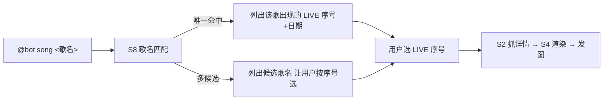

# 子项目：歌曲列表 bot（songbot）— S8 歌曲反查 Live 计划

> 所属：songbot 子项目（`docs/S-songbot-plan.md` 的追加能力，S1–S6 已完成）。
> 目标：群内 `@bot song <歌名>` → 列出该歌曲出现过的所有 LIVE（序号 + 日期）→ 用户选序号 → 渲染该公演完整 setlist 图片。
> 创建：2026-08-27；状态：✅ **S8 已完成（2026-08-27：实施计划见 `docs/modules/S8-song-lookup-plan.md`，
> 工作日志见 `docs/modules/S8-song-lookup-worklog.md`；`s8_song_index.py` + bot 集成 + 21/21 单测 +
> acceptance_song 离线 ALL PASS（含 S8 检查）+ 探针离线验证 + **测试群 live 验收通过**）**。

---

## 0. 已拍板决策（2026-08-27）

| 项 | 决策 |
|---|---|
| 输入语法 | `@bot song <歌名>`（与 `@bot live <Live名\|年月>` 并列；**强制命令前缀**，无前缀回用法提示） |
| 数据源 | 歌曲详情页 `/song/detail/N.html` 只含 楽曲情報/作家情報/その他の情報/収録CD情報，**不列出演 LIVE** → 反向索引由「扫描全部公演 setlist」构建 |
| 索引构建 | 启动时**全量预扫**建索引 + 落盘持久缓存；**每次 `song` 查询前增量刷新**（重抓列表页 diff 新事件 URL，仅抓新增 setlist 并入索引） |
| 交互 | 两段式：列出现 LIVE（序号+日期）→ 选序号 → 复用 `_full_flow` 渲染发图 |
| 歌名匹配 | 复用 `s3_match` 的 `normalize` + 打分策略（`match_songs`） |

---

## 1. 目标与范围

- **输入**：`@bot song <歌名>`（日文/英文/缩写皆可）。
- **处理**：歌名匹配 → 反向索引查出该歌出现过的所有 LIVE → 两段式确认 → 渲染 setlist 图片。
- **输出**：所选公演的完整「セットリスト」图片（复用 S2/S4）。
- **非目标**：不做歌曲详情（作家/CD 信息）展示、不做跨库检索、不做歌名增量推送。

## 2. 现状调研结论（逆向，2026-08-27）

| 项 | 结论 |
|---|---|
| 歌曲详情页 | `/song/detail/285.html`（Marionetteは眠らない）仅 楽曲情報 / 作家情報 / その他の情報 / 収録CD情報 四章，**无出演 LIVE 列表** |
| 反向索引来源 | 全部公演详情页 `table.tracklist` 的 `Track.title`（歌名，S2 已解析；S1 列表页提供全部详情 URL） |
| 规模 | 详情页总数约 **331** 个（单页 34 + 子公演 297），需一次性抓取建索引 |
| 复用 | 歌名匹配复用 `s3_match.normalize` 与打分；渲染复用 `s4_render`；发送复用 `m6_notifier` |

## 3. 交互流程



- 与 `live` 一致的两段式；`song` 首段产出「该歌出现过的 LIVE」列表并 `SessionStore` 记候选，第二段选序号 → `_full_flow`。
- 歌名多义时多一层「选歌」：候选歌名 → 选歌 → 列 LIVE → 选 LIVE（会话 context 需新增 `CTX_SONG_CANDIDATES` / `CTX_SONG_LIVES` 两种 kind）。
- 每轮交互都需 @bot（未 @ 忽略，2026-08-27 拍板）；「出现过的 LIVE」列表走 `render_list` 图片（S4 泛化，带「回复序号」footer）。

## 4. 契约扩展（`songbot/models_song.py`）

```python
@dataclass Appearance:         # 歌曲在某一公演的一次出演
    event_title: str           # 事件名
    event_year: str            # "2026"
    sub_title: str             # 子公演标题；单页事件为 ""
    date: str                  # 日期文本
    url: str                   # 该公演详情页 URL（渲染用）

@dataclass SongEntry:          # 反向索引一条（一首歌）
    title: str                 # 歌名（原文本，展示用）
    appearances: list[Appearance]
```

## 5. 模块与验收

| 模块 | 职责 | 验收 |
|---|---|---|
| **S8.1 `s8_song_index.py`** | `build_song_index(events, fetch_setlist)` 全量构建；`refresh_song_index(index, events, fetch_setlist)` 增量（diff 详情 URL，仅抓新增）；`save/load` 落盘 JSON 缓存 | 索引覆盖全部事件；增量只抓新增 URL；缓存读回一致 |
| **S8.2 歌名匹配** | `match_songs(query, index)`：复用 `normalize` + 打分，唯一命中或候选 | 样本（Marionetteは眠らない / Dance in the Light 等）命中正确、多候选排序合理 |
| **S8.3 bot 集成** | `bot.py` 加 `song` 分支（`split_command` 后）；两段式复用会话；`USAGE` 更新；**追加：列表走 `render_list` 图片 + @-only 门控** | 测试群 `@bot song` 两段走通（live） |

## 6. 风险与对策

| 风险 | 对策 |
|---|---|
| 首次建索引约 331 请求耗时 | 启动后台构建 + 落盘缓存 + 构建中提示「歌曲索引构建中」 |
| 新 LIVE 出现 | 每次 `song` 查询前重抓列表页 diff 事件 URL，仅抓新增并入索引 |
| 歌名重名/变体 | 复用候选列表，不静默猜 |
| 站点改版 | 选择器集中常量（复用 S1/S2） |

## 7. 交付物

```
songbot/s8_song_index.py     # 索引构建 + 增量刷新 + 缓存 + match_songs
models_song.py               # 契约扩展 Appearance / SongEntry
tests/test_s8_song_index.py
scripts/probe_song_index.py  # 探针：构建索引 + 打印某歌出现过的 LIVE
docs/modules/S8-song-lookup-worklog.md
data/songbot_song_index.json # 反向索引持久缓存
```

## 8. 维护约定

- 契约改动回改本文档 §4 与 `S-songbot-plan.md` §5.1。
- 完成后同步 `docs/index.md` §6 与 `docs/songbot-usage.md`（群内使用说明）。
