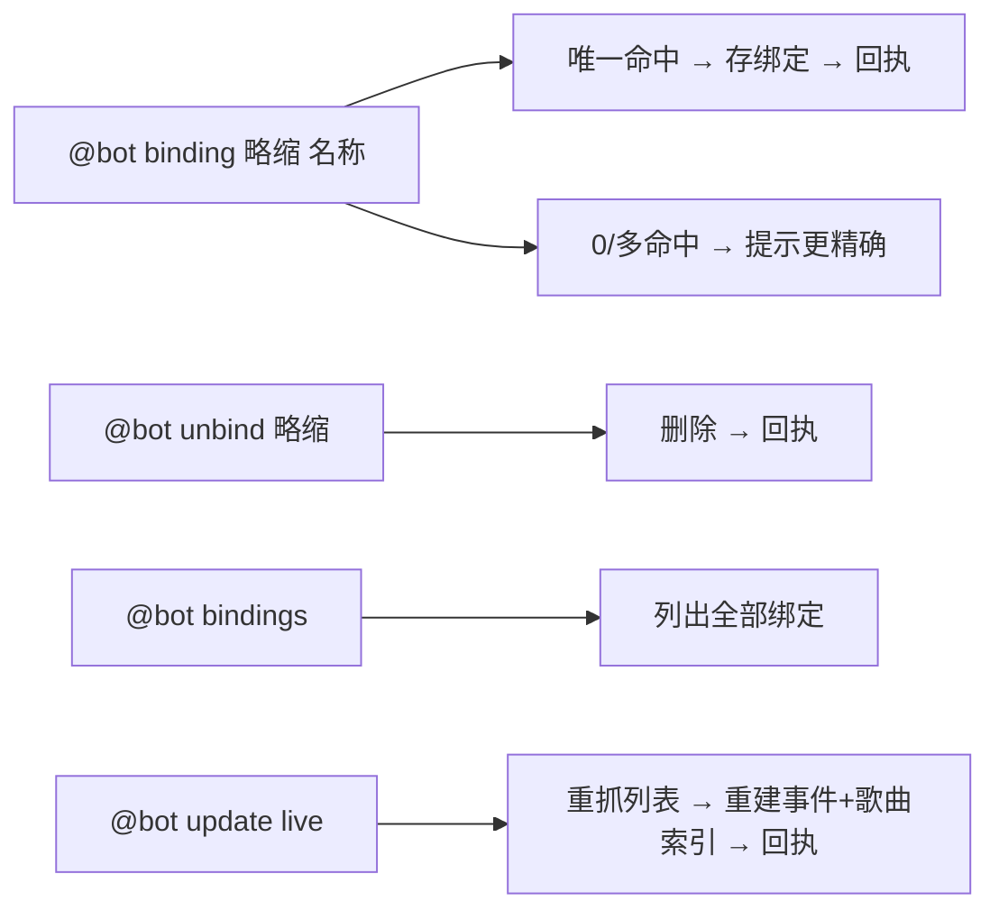

# 子项目：歌曲列表 bot（songbot）— S9 绑定别名 + 手动刷新计划

> 所属：songbot 子项目（`docs/S-songbot-plan.md` 的追加能力，S1–S6 已完成，S8 歌曲反查为独立计划）。
> 目标：`@bot binding <略缩> <event_name>` 动态绑定自定义略缩；`@bot update live` 手动全量刷新事件 + 歌曲索引。
> 创建：2026-08-27；状态：✅ **S9 已完成（2026-08-27：强制前缀命令 + `s9_binding.py` + `split_command` + `refresh_all`，单测与离线全链路验收通过，详见 [`docs/modules/S9-bindings-update-worklog.md`](modules/S9-bindings-update-worklog.md)）**。

---

## 0. 已拍板决策（2026-08-27）

| 项 | 决策 |
|---|---|
| binding 命令集 | `binding <略缩> <event_name>`（设置/覆盖）+ `unbind <略缩>`（删除）+ `bindings`（列出全部） |
| 绑定解析 | `event_name` 用 `match_events` 解析，**唯一命中才绑**；0/多命中提示「请用更精确的名字」，不列候选 |
| 绑定优先级 | `live <略缩>` 先查绑定（精确 normalize 匹配）→ 时间查询 → 名称匹配；绑定只影响 `live` 分支 |
| 持久化 | `data/songbot_bindings.json`（复用 index_cache 模式；绑定值存序列化 Event） |
| update live | 手动全量刷新：重抓事件列表 → 重建事件索引 → 重建歌曲反向索引 → 落盘缓存；回报「N 事件 / M 歌曲」 |
| **权限控制（2026-08-27 追加拍板）** | **`binding` / `unbind` / `bindings` / `update live` 仅群主/管理员可用**（OneBot `sender.role` ∈ `owner`/`administrator`；缺失/非法值按 `member` 收紧拒绝）；`live`/`song` 全员可用 |

---

## 1. 目标与范围

- **输入**：`@bot binding <略缩> <event_name>` / `@bot unbind <略缩>` / `@bot bindings` / `@bot update live`。
- **处理**：绑定 = 存/删/查自定义略缩，影响 `live` 解析；update = 手动重建全库索引。
- **权限**（2026-08-27 追加）：`binding`/`unbind`/`bindings`/`update live` 仅群主/管理员可用（`sender.role`）；普通成员收到拒绝提示。
- **非目标**：不做多账号、不做跨机同步。

## 2. 交互流程



- 每轮交互都需 @bot（未 @ 忽略）；`bindings` 列表走 `render_list` 图片（S4 泛化）；`binding`/`unbind`/`update live` 回执为短文本。

## 3. 契约与存储

- **无 dataclass 变更**；绑定值 = 序列化 `Event`（复用 `bot.py` 已有的 `_event_to_dict` / `_event_from_dict`）。
- 存储：`data/songbot_bindings.json`，形如 `{略缩(normalize): event_dict}`；启动加载、变更即存。

## 4. 模块与验收

| 模块 | 职责 | 验收 |
|---|---|---|
| **S9.1 `s9_binding.py`** | `BindingStore`（线程安全：`set`/`get`/`remove`/`list` + JSON 持久化）+ `resolve_binding(query)`（精确 normalize 匹配） | set/get/remove/list 正确、持久化读回一致、并发安全 |
| **S9.2 bot 集成** | `_first_stage` 加 `binding`/`unbind`/`bindings`/`update` 分支；`live` 解析先查绑定；`SongBot.refresh_all()`（`update live`）；**管理命令权限：`sender.role` ∈ `owner`/`administrator` 才放行，member 拒绝**（`s5_receiver` 解析 role）；`bindings` 列表走 `render_list` 图片 | 绑定后 `live <略缩>` 命中；`update live` 后索引刷新；member 用管理命令收到拒绝提示且无副作用 |

## 5. 风险与对策

| 风险 | 对策 |
|---|---|
| 略缩与事件名混淆 | 略缩须单 token（无空格）；按首个空白切分 |
| 绑定失效（事件下架/改版） | `live` 解析时绑定事件不存在则忽略并提示；`update live` 后重建索引 |
| 并发 update 与查询 | 重建期间旧索引继续服务，完成后原子替换 |
| 持久化写入失败 | 记日志不崩，内存内仍生效 |

## 6. 交付物

```
songbot/s9_binding.py           # BindingStore + resolve_binding
tests/test_s9_binding.py
data/songbot_bindings.json      # 绑定持久缓存
docs/modules/S9-bindings-update-worklog.md
```

## 7. 维护约定

- 完成后同步 `docs/index.md` §6 与 `docs/songbot-usage.md`（群内使用说明）。
